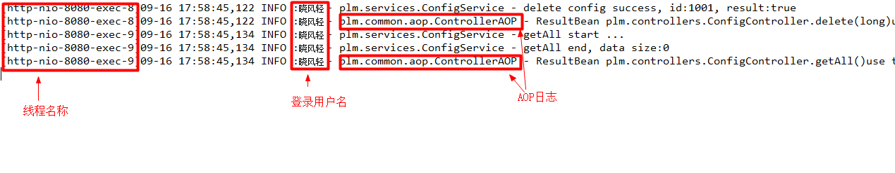
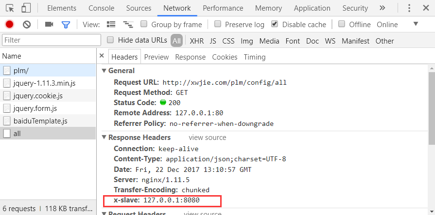

# 晓风轻的Spring开发代码模板

> 本文的面向目标群为编写业务代码的初学者。
>
> 本文的目的是编写简单易读的代码。

给部门制定的代码框架模板。追求工匠精神，编写简单代码。

作者微信交流

 

pdf电子书请见ebook目录。

[`SpringBoot版本在这里`](https://github.com/xwjie/ElementVueSpringbootCodeTemplate)**，持续更新中，后续加入vue+element的代码模板，欢迎加星加watch。**

# 前言

参考 [**程序员你为什么这么累**](https://zhuanlan.zhihu.com/p/28705206) 系列文章 ，里面有详细的讲解，评论里面有不同观点的讨论，建议也看看，相信对你有帮助。


# 工程使用说明

工程使用jdk6+，使用了[lombok](https://projectlombok.org/)插件。在 Idea 里面选择 `source`目录导入 `Maven`  工程即可。然后在Tomcat里面运行工程即可。

启动项目，访问地址 `http://localhost:8080/+[应用名（可为空）]` 即可。

[工程使用详细说明](docs/install.md)

# 目录

**以下为简要说明，详细说明请看 [https://xwjie.github.io/](https://xwjie.github.io/)**

> * 优雅编码 - 接口定义规范
> * 优雅编码 - ResultBean的重要性和约束
> * 优雅编码 - 异常处理
> * 优雅编码 - 参数校验和国际化规范
> * 优雅编码 - 日志打印
> * 优雅编码 - 工具类编写
> * 技术点总结
> * 对开发组长的要求
> * 对开发人员的建议

# 优雅编码 - 接口定义规范

请阅读 [我的编码习惯 - 接口定义](https://zhuanlan.zhihu.com/p/28708259) ，不要犯里面的错误。

1. 所有接口都必须返回ResultBean。
2. 一开始就要考虑成功和失败二种场景。
3. ResultBean只允许出现在controller，不允许到处传。
4. 不要出现 map ，json 等复杂对象做为输入和输出。
5. 不要出现 local ，messagesource 等和业务无关的参数。

# 优雅编码 - ResultBean的重要性和约束

请阅读 [我的编码习惯 - Controller规范](https://zhuanlan.zhihu.com/p/28717374)。

这里都是对开发组长的要求。使用 `AOP` 统一处理异常，并根据不同异常返回不同返回码。尤其关注非用户自己抛出的异常。

# 优雅编码 - 异常处理

请阅读 [我的编码习惯 - 异常处理](https://zhuanlan.zhihu.com/p/29005176)。

1. 开发人员不准捕获异常，直接抛出。
2. 少加空判断。如果对象不应该为空，就不需要加空判断，加了空判断就要测试为空和不为空二种情况。

其他对开发组长的要求请见上面的文章和代码。

# 优雅编码 - 日志打印

请阅读 [我的编程习惯 - 日志建议](https://zhuanlan.zhihu.com/p/28629319)。

## 分支语句的变量需要打印变量

分支语句变量会影响代码走向，不打日志无法知道究竟走那个分支。如下

```Java
// optype决定代码走向，需要打印日志
logger.info("edit user, opType:" + opType);

if (opType == CREATE) {
  // 新增操作
} else if (opType == UPDATE) {
  // 修改操作
} else {
  // 错误的类型，抛出异常
  throw new IllegalArgumentException("unknown optype:" + opType);
}
```

如果没有打印optype的值，出了问题你只能从前找到后，看optype是什么了，很浪费时间。

> 重要建议：养成增加else语句，把不合法参数抛出异常的好习惯。
>
> 抛异常的时候把对应的非法值抛出来。

## 修改操作需要打印操作的对象

这点是为了跟踪。防止出现，一个数据被删除了，找不到谁做的。如

```Java
private void deleteDoc(long id) {

  logger.info("delete doc, id:" + id);

  // 删除代码
}
```

## 大量数据操作的时候需要打印数据长度

建议前后打印日志，而且要打印出数据长度，目的是为了知道 `处理了多少数据用了多少时间` 。如一个操作用了3秒钟，性能是好还是坏？ 如果处理了1条数据，那么可能就是性能差，如果处理了10000条数据，那么可能就是性能好。

```Java
logger.info("query docment start, params:" + params);

List<Document> docList = query(params);

logger.info("query docment done, size:" + docList.size())
```

## 使用log4j的MDC打印用户名等额外信息

有时候，业务量大的系统要找到某一个用户的操作日志定位问题非常痛苦，每一个日志上加用户名又低效也容易漏掉，所以我们要在更高层级上解决这些共性问题。

我们使用log4j的 `MDC` 功能达成这个目的。在用户登录后，把用户标志放到 `MDC` 中。

```Java
private final static ThreadLocal<String> tlUser = new ThreadLocal<>();

public static final String KEY_USER = "user";

public static void setUser(String userid) {
  tlUser.set(userid);

  // 把用户信息放到log4j
  MDC.put(KEY_USER, userid);
}
```

然后修改log4j配置，pattern上增加 `%X{user}` ，位置随意。增加线程相关配置 `[%t]` 。更多参数[log4j变量](https://logging.apache.org/log4j/1.2/apidocs/org/apache/log4j/PatternLayout.html)

```XML
<layout class="org.apache.log4j.PatternLayout">
  <param name="ConversionPattern" value="[%t]%-d{MM-dd HH:mm:ss,SSS} %-5p: %X{user} - %c - %m%n" />/>
</layout>
```

最终效果图：



> 没有用户信息的时候并不会报错，而是空串。
>
> 不要一开始就关注日志级别和日志性能，规则越多越难落地。
>
> 必须记得清空。

## 集群环境下需要在静态服务器增加配置，返回处理机器的信息到响应头

配置后可以直接找到代码在那个机器上运行，快速定位。举例，`Nginx` 集群最简配置（主要使用 `$upstream_addr`） ：

```
upstream code_server{
  server 127.0.0.1:8080;
  server 127.0.0.1:18080;
  ip_hash;
  keepalive 32;
}

server{
  listen 80;
  server_name xwjie.com;

  location /plm {
    proxy_pass http://code_server/plm;
    add_header x-slave $upstream_addr;
  }

}
```

效果图：



# 优雅编码 - 参数校验和国际化规范

请阅读 [我的编码习惯 - 参数校验和国际化规范](https://zhuanlan.zhihu.com/p/29129469) 。

1. 调用自己的校验函数
2. 业务代码任何地方参数上都不要出现local，messagesource
3. 异常信息里面，不正确的参数值要提示出来，减少定位时间
4. 国际化参数不要放到每一个url上

# 优雅编码 - 工具类编写

请阅读 [我的编码习惯 - 工具类规范](https://zhuanlan.zhihu.com/p/29199049) 。

工具类的目标是要编写通用灵活的方法。重点注意参数的优化，多使用重载。

1. 隐藏实现，编写自己的工具类方法，不要再业务代码直接调用第三方工具类
2. 使用父类/接口
3. 使用重载编写衍生函数组
4. 使用静态引入，方便找到工具方法
5. 物理上独立存放，独立维护

# 技术点总结

1. spring的aop的使用
2. log4j的MDC使用
3. JDK的ThreadLocal的使用

# 对开发组长的要求

定义好代码框架，不要做太多、太细的要求，否则无法落地。这篇文章中，规范中要求做到的少，不准做的多，落地相对容易。

1. 定义好统一的接口格式、异常、常量等
2. 多使用AOP和ThreadLocal简化代码
3. 亲自编写校验函数和工具类
4. 代码评审中，严格控制函数的参数，不允许出现复杂参数和业务无关的参数

# 对开发人员的建议

1. 不要养成面对debug编程，用日志代替debug
2. 不要一上来就做整个功能测试，要一行一行代码一个一个函数测试
3. 谨慎捕获异常和加空判断，加了空判断就要测试为空和不为空二种情况
4. 日志也是代码的一部分，提交代码前先运行看一遍操作日志


